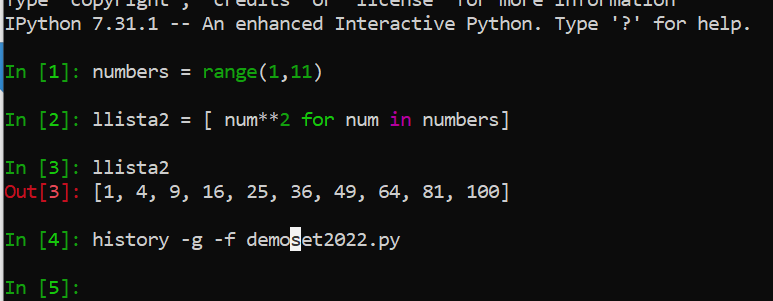
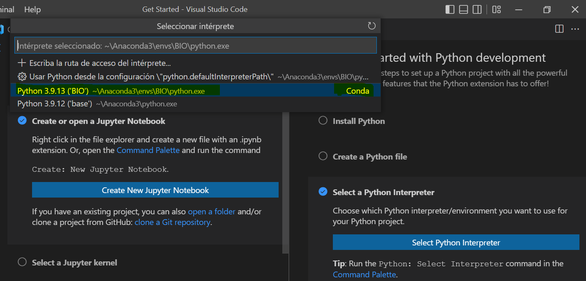

# Instalació entorn i tecnologies de treball.

A l'inici de la guia ens hem de decantar per una de les 2 opcions de treball.

<a name="toc"></a>

* [Op1. Instal·lació de màquina virtual Linux.](#op1_vm_linuxserver)
* [Op2. Instal·lació de Linux nativa dins d'un SSD.](#op2_ssd_installpopos)
* [Utilitats Linux](#linux_utils)
* [Instal·lació d´una versió de Python diferent del sistema Linux amb venv](#python3_venv)
* [Intèrprets de Python](#interprets)
* [Entorn JupyterLab](#jupyterlab)
* [IDE VSCode](#vscode)

#### Primerament recordem com instal·lar PopOS! 

[M01. Doc.Comp. Instal·lació màquina virtual Linux PopOS! 22 LTS](https://docs.google.com/document/d/196580myY0i2MUFI7PPs2n_RtYO3jUaropxpODqnrCyU/edit#heading=h.ool1wwrkfx9s)
[M01. PDF. Instal·lació màquina virtual Linux PopOS! 22 LTS, setembre 2023](./DAWBIO1-M01-UF1-NF2%20INSTAL·LACIÓ%20POPOS22%20LTS%20AMB%20VIRTUALBOX.pdf)


<a name="op1_vm_linuxserver"></a>

En el cas de voler tenir d'una màquina virtual de Linux amb VirtualBox, suposant que el sistema operatiu host és Windows (el cas de l'institut) seguiu aquestes recomanacions.

Podeu triar 2 opcions:
1. Instal·lar PopOS o Ubuntu 22.04 LTS en una màquina virtual si no els teniu. Si ja els teniu els podeu aprofitar.
2. Instal·lar Ubuntu Server si voleu una experiència més fluida, ja que al no disposar d'entorn gràfic (que  segurament no el necessitareu) es consumeix menys RAM i CPU.

## TODO. Document de treball d'aquesta opció, li trauré el link quan acabi:

https://docs.google.com/document/d/1rcFciC9QomiV08VoHR40ZTcBzzehsiyDft2euRNbFlM/edit


<a name="op2_ssd_installpopos"></a>

En el cas de voler tenir l'entorn dins d'un disc dur SSD seguiu aquestes indicacions.

Recomanem instal·lar PopOS 22.04 LTS al disc si no el tenim.

**Si teniu Ubuntu o PopOS 22 LTS funcionarà tot OK per aquest curs.**

### <strong style="color:red;"> Abans de tot, cal fer còpies de seguretat de totes les dades!</strong>

En canvi, si teniu PopOS 20 LTS o Ubuntu recomanem la instal·lació des de 0 en comptes del **full-upgrade**. 

Tot i que [la pàgina oficial assegura que amb dues comandes s'actualitza el sistema](https://support.system76.com/articles/upgrade-pop/), la veritat és que en ocasions poden deixar de funcionar programes i perifèrics després de l'actualització. Amb Ubuntu ens ha passat i Popos també hi ha risc que passi. 
Per ara, desaconsellem instal·lar la versió 23 d'aquests sistemes, millor esperar a la 24 i només quan la declarin LTS.

### Hardware necessari.
 - USB(3.0) de >= 8 GB Linux
 - ISO amb el PopOS (iso és el fitxer que té l'estructura d´un cd) El ordinador creurà que la ISO és un CD. → Instal·lador y un modo live(de prueba). 
 - Disc dur SSD >= 128 GB → Aconsellats: Crucial, SanDisk, Kingston, PNY. Comprar-los a PC Componentes o comerços online grans.
 - Cable Sata USB 3.0 -> Els discs durs SSD que no venen amb cable USB són més econòmics i permeten obrir la torre i endollar-los; sempre podeu comprar el cable USB apart. En moltes ocasions comprar els 2 components és més barat que comprar un disc dur SSD amb cable USB inclòs. 

### Programari necessari (2 opcions)

1. **Màquina arranca en mode UEFI**, baixar la ISO de --> [Pop_Os](https://pop.system76.com/)
  
Instalador fàcil, No usa GRUB, sino systemd-boot. 

Alternativa Espanyola del systemd-boot [Slimbook](https://slimbook.es/). 

El SystemBoot de la BIOS ha d'estar desactivat.

2. **Màquina NO arranca en mode UEFI o no es vol PopOS** baixar la ultima [ISO de Ubuntu Desktop LTS](https://ubuntu.com/download/desktop) 

### Passos a seguir per l'USB bootable

 1. Descarregar iso escollida.
 2. Executar el [BalenaEtcher](https://www.balena.io/etcher/), esculleixes la ISO(elegida) i t'assegures de triar l'USB, **⚠️ no el disc dur del PC ⚠️**
 3. Arrancar amb el usb en lloc del disc dur. Amb la tecla que sigui per arrancar la uefi(ESC/F2/F1/F8/F9)

#### Glossari:

> **Firmware**, el software dins del hardware perquè funcioni.

> **Bios** - Basci Input/Output System - Mort al 2013
> - Tabla Particions MBR, màxim 4 particions primàries per disc

> **UEFI** - Universal EFI = EFI 20 Extensible Firmware Interface - Live -
>  Tabla Particiones GPT: GUID Partition table, Màxim 128 particions primàries per disc

> **UUID:** Universal Unique ID

 3. Arrancar en **mode UEFI el usb** → Hi ha l´opció try demo, que és recomanable per provar si funciona el sistema operatiu abans de fer la còpia al ssd,  i les opcions a escollir, preferentment serien: 
    - Software  Angles-Irlanda
    - Elegir keyboard-Español amb especificació català si volem
    - Escollir l´opciò **Clean Storm**, borra tots els fitxers. 
    - Aquí tries el disc dur extern. ⚠️ Aquest moment has de triar el disc dur (SSD) i no equivocar-te. ⚠️
    - No escollir l´opció encriptar el password, perque si hi ha un problema, des de fora es pot ajudar una mica més.

<a name="linux_utils"></a>

### Utilitats i comandes Ubuntu

- **INXI** --> és una ordre que trobem en l'última versió d'Ubuntu (i PopOS) i que ens mostra totes les especificacions de l´equip, des del sòcol del processador fins al nucli de sistema operatiu que estem fent servir passant pels processos oberts que està executant el sistema operatiu.

```sh
apt install inxi
inxi
```

- **System Monitor -->**  Recomanable [crear una drecera per activar el system-monitor per si es realenteix el sistema](https://askubuntu.com/questions/399992/how-to-open-system-monitor-easily). 
És l'equivalent al Adm. Tasques del Windows.

[Índex de continguts](#toc)

<hr/>
<a name="python3_venv"></a>

## Instal·lació d´una versió de Python diferent del sistema Linux.

🚩 És convenient no utilitzar el Python que ve instal·lat per defecte a Linux (que el necessita el SO), sinó crear un entorn virtual amb el seu Python, les seves llibreries i aïllat del sistema. Això ho farem amb venv (Virtualenv) i pip.

🚩 També és important no utilitzar la comanda sudo a partir d'ara, treballarem en mode usuari sense privilegis per no alterar el SO. A les companyies on treballarem rarament estarem al grup de sudoers (rarament serem admin). 

🚩 Per tant, prohibit <strike>sudo pip install ... </strike>

Fem unes comprovacions prèvies:

- Per saber la versió que tenim de Python,  escriure a la línia de terminal **python3 --version**
- Per saber on és l'executable del teu python **which -a python3**. 
- Es pot utilitzar **ls -lisah /bin/python3**, i es veu on es localitza l'executable i es veu quin executable realment utilitza, quant a la terminal escrivim python3. Al llistat pot sortir **blau claret**, que vol dir que és executable.
	  
- Per poder instal·lar la nostra versió de python, necessitem saber on es troben els python de sistema, per no fer-los malbé. Posarem la comanda **echo $PATH | sed -E "s/:/\n/g"**.

Ara sí, instal·larem:
- **Gestor d'entorns virtuals venv**. És un directori amb llibreries i executables, aïllats de la resta. Així evitem problemes de compatibilitat. 

- **Gestor de paquets pip** Conjunt d´arxius necessaris per a un executable o llibreria, necessari per extendre les possibilitats de les llibreries estàndard de Python. Suporta Python i R.
	       
L´instal·larem perque no requereix permis d'administrador (ideal per empreses)

ⓘ Una alternativa seria usar el gestor Anaconda, que proporciona les 2 funcions alhora, però és una mica més pesat i no és tan senzill d’integrar amb Docker, per això ho descartem. ⓘ


1.  Baixarem l'instal·lador de la pagina oficial de [Anaconda](https://www.anaconda.com/products/distribution) 

Aplica aquestes comandes des de la terminal bash:

```sh
$ python3 -m venv .bio
$ source .bio/bin/activate
(bio) 
```

Fixa't que a la tercera línia, i al arrencar el terminal et sortirà la paraula (bio), és l'espai de l'entorn que hem creat a la primera línia, i hem activat a la segona. 

Si volem desactivar-lo (per si volem tenir 2 entorns):
```sh
(bio) $ deactivate
$
```

**⚠ Important! Assegureu-vos que al treballar sempre tingueu activat (i visible) el vostre entorn ⚠**

<hr/>

### Instal·lació Python --> 

Un cop instal·lat un entorn de Conda, Python queda instal·lat a la última versió (la 3.10 l'any 2022, 3.11 2023).

Ho podem verificar mitjançant la comanda:
```sh
python --version
```

[Índex de continguts](#toc)

<hr/>
<a name="interprets"></a>

## Intèrprets, amb els que podem treballar amb python:

- **python3**
Molt bàsic.

- **ipython** (depen del python3), versió amb format enriquit i amb colors. Versió no oficial de python. Ens permet guardar l'historial, ideal per fer proves ràpides.
- 


- **jupiterlab** (va al navegador i treballar amb ipython),[cheatsheet JupiterLab](https://blog.ja-ke.tech/assets/jupyterlab-shortcuts/Shortcuts.png "cheatsheet JupiterLab"), ficarem per executarlo a la consola 

```bash
jupyter lab
```

[Índex de continguts](#toc)

<a name="jupyterlab"></a>

### Entorn JupyterLab

JupyterLab és una interfície d'usuari basada en web per a Júpiter del projecte i està estretament integrat a Adobe Experience Platform i Google Colab.

Proporciona un entorn de desenvolupament interactiu perquè els científics de dades treballin amb Jupyter Notebooks, codi i dades.

#### Instal·lació [Jupyter Lab](https://jupyter.org/). 

Comanda (directori no oficial): 

```bash
conda install -n nomenv -c conda-forge jupyterlab
```

<a name="vscode"></a>

### Integració IDE VSCode.

Va molt bé integrar el nostre entorn operatiu a Visual Studio Code. Tant si esteu usant Windows+Linux com únicament Linux.

**⚠ Important! Si esteu a Linux, instal.leu la versió deb, no la flatpak.⚠**

La podeu instal.lar o bé pel PopOS! Shop

O bé pel terminal

```bash
apt-get install vscode
```

VSCode ens pregunta si volem instal.lar eines per a Pyhton, li diem que sí. 
També podem instal.lar-ne per a Markdown. 

A la part inferior per defecte ens sortirà el Python que tenim a la màquina. 

Si la instal.lació de venv ha funcionat hem de seleccionar el Python de l'entorn de Conda que hem instal.lat prèviament.



Podem provar els 2 tipus de fitxers.
1. Un de Pyhton (*.py)
2. Un de Jupyter Notebook (*.ipynb)


**Area de treball** 

  Extensió dels projectes: **.ipynb**  

  2 modes de treball:
  
  --> 1 Edició
  
  --> 2 Comandes
				   
  2 tipus de cel·la: 
  
  --> Python (tecla ESC i despres'y'), serveix per codificar
  
  --> Markdown (tecla ESC i despres 'm'), serveix per documentar la codificació
		   	   
**Abreviaturas**

	Shift+Intro --> Executar una cel·la i anar a la següent
	Ctrl + Intro --> Executar una cel·la i es queda a la mateixa.

[Índex de continguts](#toc)

<hr/>